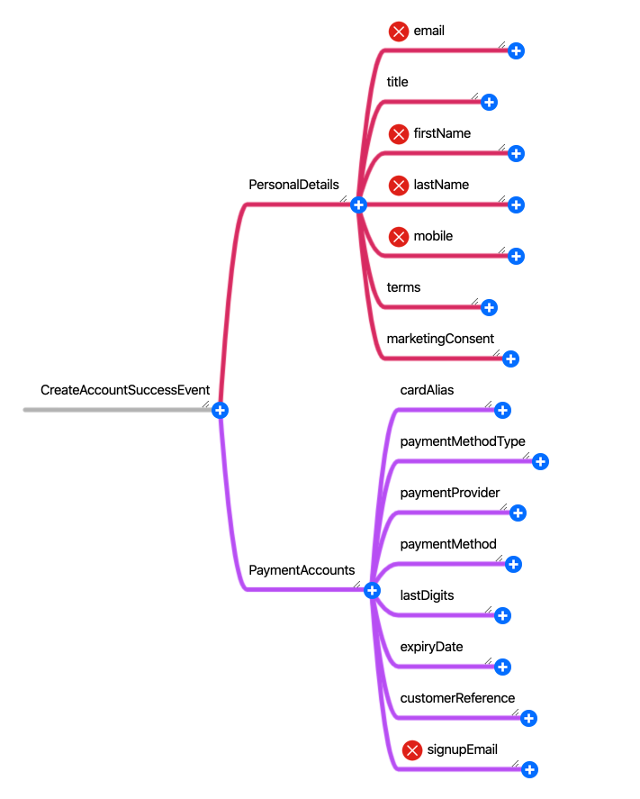

# Masking

- ADT (Algebraic Data Type)
  - Sealed traits (Coproducts)
  - Case classes (Products)
- Type classes
  - Traits
  - Implicits
- Optics
  - Monocle
- Type level programming
  - Shapeless
  
